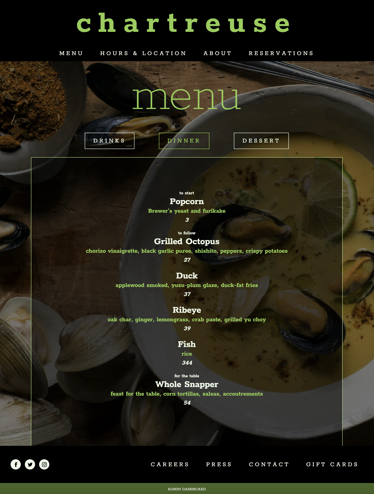
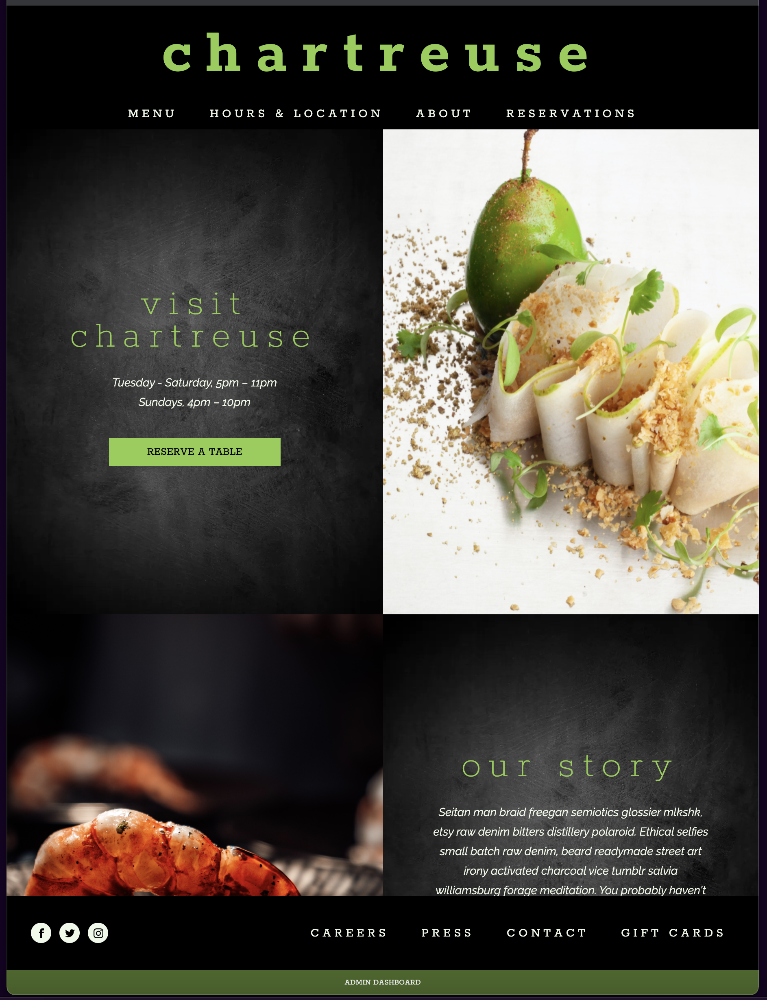
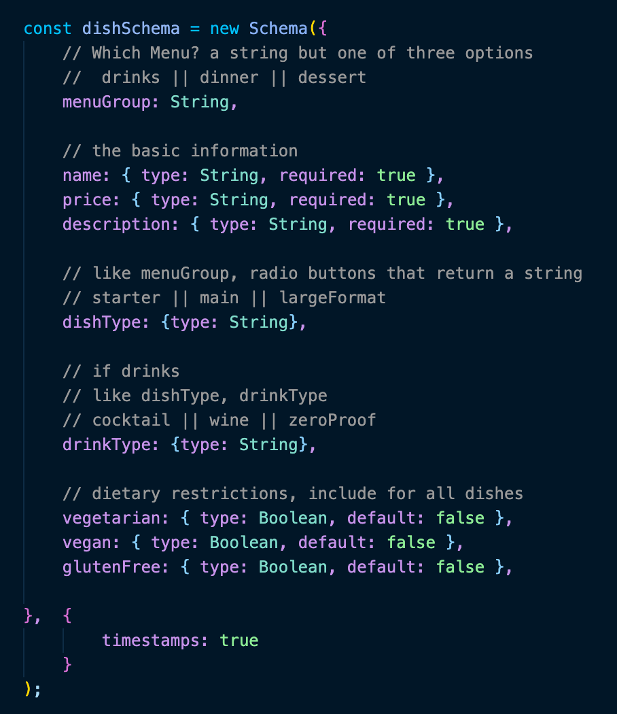

# "Chartreuse"

## App for an imaginary restaurant
***
Chartreuse is a project created by Blake Montgomery. It is the start of an idea: what if the restaurant's website, was also it's menu, and also a repository of dishes and drinks even if they are not currently on the menu. What other functionality could be integrated? Perhaps information on all dishes and how they are prepared as resources for cooks or waitstaff.

The project takes its inspiration from the liqueur of the same name. A bold,yet finely nuanced, alcoholic brew of over 130 herbs and spices. It inspired this fancy and fanciful vision of French cuisine as if half-remembered after an elongated and slightly off the beaten path journey along the spice routes of old.
 
 

## Technologies Employed
***
Chartreuse is a full-stack, single-page application hosted on Heroku which uses the technologies of the MERN-stack:

* MongoDB
* Express
* React
* Node

The styling of the app is done with hand-coded css.
 
 

## Visit Chartreuse
***
The app incorporates a dynamic front-end which offers an exploratory role for the general public as well as functional capability for the restaurant management. You will find the link to open the admin dashboard at the bottom center of the page on the dark green footer strip.

There is currently no authentication/authorization process so you can freely explore in the role of casual user or a member of staff.

## [CHARTREUSE...THIS IS THE APP](https://infinite-cove-47012.herokuapp.com/)

 
 

## Further Information
***
1. Behind The Scenes (Images)
1. Challenges and Unsolved Issues
1. Desired Features

 

### Behind The Scenes
***

 

### Challenges and Issues
***
While there were some javascript challenges around the visual of the app, such as how to create a regularly changing background using useEffect to control a setInterval call, I think more challenges lie in the delivery of the data and how to render various search parameters. From the basics of where the logic is located to how to efficiently manage an escalating set of conditions, I underestimated the challenge of delivering different views of the data in an SPA.

 
### Future Enhancements
The first area I'd like to work on is the menu display. So much work went into getting the data from the various input types (text, checkboxes and radio buttons) properly into the database that it's a number one priority to get that displayed to the user. Especially the ability to look at the menu and what is offered for various dietary restrictions.

Further work needs to be done on the admin user end as well. The dashboard access must be only to authenticated/authorized users and all controls should be removed from public view. Before that, though, the first goal is the build out the view/edit capabilities to the full range of menu details captured in the database.
